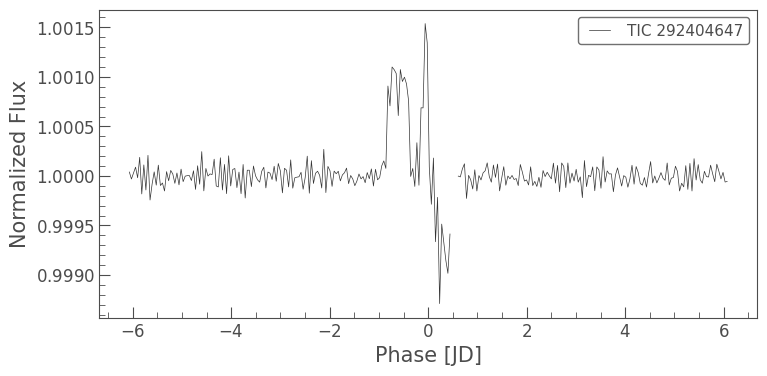
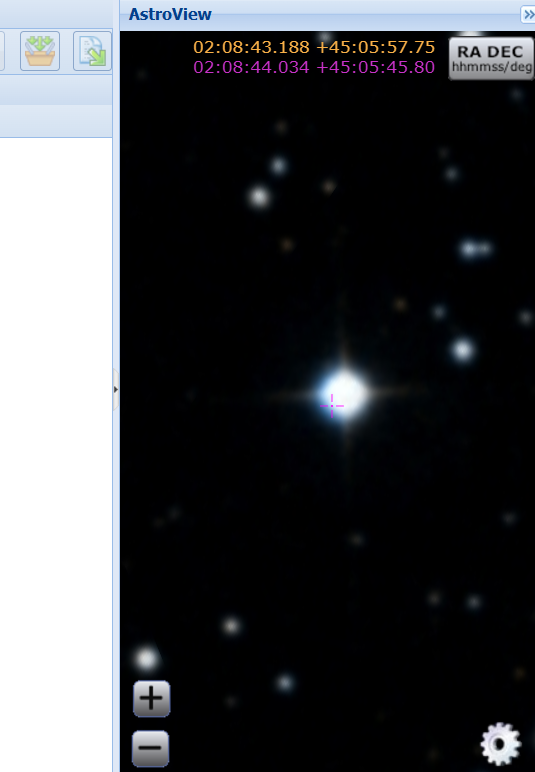

# Lightcurve Analysis for Star Discovery
     
***

This project analyzes lightcurve data from the TESS (Transiting Exoplanet Survey Satellite) mission to study a particular star's brightness variations over time. Using FITS files provided by the TESS archive, the data is processed to identify periodic signals that may indicate phenomena such as starspots or potential exoplanet transits.

***
## Note: The findings presented here are preliminary and require further validation to ascertain their significance.
***
Focusing on the star **TIC 292404647**, a periodic **rise** in the luminosity was found in the data recorded. This can be an indication of several phenomenon:
- The star being a Cepheid/RR Lyrae star, which SIMBAD does not list as one yet,
- The star being a flare stars, which SIMBAD does not list as one yet,
- The presence of a dust cloud in the observation, although in this case the periodic nature would be tough to explain, which will be ascertained with the available of data with longer exposure,
- Rotation Modeulation of the star, which will be ascertained with the available of data with longer exposure 

**As of 27-11-2024 0113hrs, no exoplanets have been registered for star TIC 292404647 on the following databases:**
- [NASA Exoplanet Archive](https://exoplanetarchive.ipac.caltech.edu/)
- [Exoplanet.eu](https://exoplanet.eu/catalog/)
- [ExoFOP](https://exofop.ipac.caltech.edu/tess/)
- [SIMBAD](https://simbad.u-strasbg.fr/simbad/sim-fcoo)
- [VizieR](https://vizier.cds.unistra.fr/viz-bin/VizieR)

**As of 27-11-2024 0127hrs, there are no annotations of the star TIC 292404647 on any papers in [SIMBAD](https://simbad.u-strasbg.fr/simbad/sim-basic?Ident=TIC+292404647&submit=SIMBAD+search)**

  

## Star Details:
- **Label**: TIC 292404647
- **Mission**: TESS
- **Sector**: 18
- **Camera**: 2
- **CCD**: 3
- **Right Ascension (RA):** 32.1834732881428
- **Declination (Dec):** 45.0960565496668

  

## Observation Period:
- **Start Time**: 2019-11-03 03:50:33
- **Exposure Length (based on current data used. May update as new data is used)**: 120s 
- **Release Date**: 2019-12-16 08:00:00

## Technology used:
- [Python](https://www.python.org/)
  - [Lightkurve](https://lightkurve.github.io/lightkurve/) v2.5: A friendly Python package for making discoveries with Kepler & TESS.
- [Jupyter Notebook](https://jupyter.org/)
## Data and Processing Overview:

1. **Loading Data**: The FITS files, containing raw lightcurve data from TESS, are loaded into the analysis pipeline.
   
2. **Lightcurve Creation**: The data is converted from the Target Pixel File (TPF) format into a lightcurve format, which provides a time-series of the star’s observed brightness.

3. **Outlier Removal**: Any outliers in the lightcurve are removed to ensure that the analysis focuses on the true stellar signal.

4. **Flattening**: The lightcurve is then flattened to remove any long-term trends, such as those caused by instrumental effects, revealing the short-term variations in the star’s brightness.

5. **Periodogram Generation**: A periodogram is created to identify the most prominent periodic signals in the lightcurve. This step is critical for detecting any periodic phenomena in the star's brightness, such as starspot rotations or exoplanet transits.

6. **Folding the Lightcurve**: The lightcurve is folded at the period with the highest power from the periodogram. This step aligns the periodic variations and produces a phase-folded lightcurve that reveals the repeating pattern of brightness changes.

7. **Binning and Plotting**: To reduce noise, the folded lightcurve is binned, and a final plot is generated to visualize the periodic behavior of the star over the observed period.

## Results:
This analysis provides insight into the star's periodic variations, which may indicate underlying astrophysical processes such as rotational modulation, eclipsing binaries, or potential transiting exoplanets. The plotted lightcurve shows a clear pattern of variability, confirming the presence of periodic behavior.

## Future Work:
- Further refinement of the periodogram and analysis to identify the exact nature of the periodic signal.
- Potential follow-up observations to confirm the discovery of an exoplanet or other periodic phenomena.

## Acknowledgments:
**Data**
- [MAST: Barbara A. Mikulski Archive for Space Telescopes](https://mast.stsci.edu/portal/Mashup/Clients/Mast/Portal.html)

***
